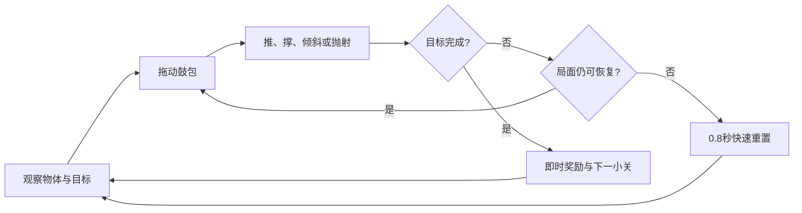

# Molewave / 地毯鼓包

> 3D 竖屏网页物理游戏独立立项文档  
> 版本：Concept Gate v1.1  
> 日期：2026-07-23  
> 目标平台：Poki 优先，CrazyGames 兼容  
> 推荐画幅：手机铺满竖屏视口并以 9:16 为安全构图；桌面使用完整 16:9 画布并保留中央 9:16 安全玩法列  
> 推荐技术：Three.js + TypeScript + Vite + Rapier  
> 当前阶段：三天灰盒验证，不进入完整制作

## v1.1 优化摘要

本次优化不增加按钮和能力，而是让核心机制更可选、更可读、更可测：

1. 将“推、撑、倾斜、抛射四种结果”收敛为玩家能主动选择的三种输入原语：**滑推、顶撑、掀射**；倾斜、翻面、分流和刹车是原语与物体属性组合后的结果。
2. 快慢判断只读取归一化水平速度；高度和升降速度单独计算，避免快速抬高被误判为掀射。
3. 首次教学由行为完成事件推进，不按绝对秒数强制换场；每个原语都必须在无提示新布局中验证迁移。
4. 多步关卡若需要玩家移开鼓包，必须使用卡槽、门栓、配重或铰接自锁等可见状态记忆，不允许暗中冻结结构。
5. 将“软挡、接稳、回流槽”纳入恢复玩法；首轮不再用“不重置”种子惩罚实验。
6. 先制作 6 个机制灰盒，再制作 10 关垂直切片；30 关只保留为通过数据门后的内容假设。
7. 补齐移动端手势状态机、桌面宽屏适配、HUD 安全区、埋点口径、黄金回放和生死线。

## 1. 立项结论

**建议进入三天灰盒。**

《Molewave》是一个以“移动连续地面的局部鼓包”为唯一操作工具的 3D 物理玩具。玩家不直接控制球、车辆或角色，而是拖动藏在地毯下的小鼹鼠，用同一个鼓包主动选择滑推、顶撑和掀射，并由此产生倾斜、翻面、分流和刹车。

它值得验证的主要原因：

- 操作点位于竖屏下方，结果发生在上方，天然减少手指遮挡。
- 3 秒内可以输入，5–10 秒内能看到明确因果。
- 同一个连续工具随位置、速度和停留时间产生不同结果，具有物理玩具性。
- 视觉可以表现为柔软连续地面，碰撞可以由一个稳定的运动学凸体完成，适合移动浏览器。
- 没有依赖角色 IP、复杂文本、暴力破坏或低修改模板，创意审核叙事相对干净。

它的主要风险也必须正面处理：

- 可能被玩家和编辑误认为“移动蹦床”。
- 如果只有把球弹高一种结果，三分钟内容会迅速枯竭。
- 视觉地毯与隐藏碰撞体若不同步，会产生明显的“不可信物理”。

因此，本项目的立项依据不是概念描述，而是三天灰盒能否证明：玩家会主动使用推、撑、倾斜和抛射，而不只是接球反弹。

## 2. 一句话提案

**单指拖动藏在连续橡胶地毯下的小鼹鼠；慢移鼓包能推着物体滚，停住能顶起和倾斜结构，快速扫过则把轻物体抛起来。**

英文短提案：

> Move the mole beneath the floor. Push slowly, hold to prop, or swipe fast to launch the toy world above.

## 3. 产品定位

| 项目 | 定义 |
|---|---|
| 类型 | 单指 3D 物理益智 / 物理玩具 |
| 核心受众 | 喜欢即时反馈、短关卡、物理实验和无字玩法的网页玩家 |
| 单关时长 | 15–45 秒 |
| 首次目标会话 | 3–5 分钟 |
| 内容规模 | 先验证 6 个机制灰盒，再制作 10 关垂直切片 + 沙盘原型；通过数据门后扩展至 30 关 + 完整沙盘 |
| 主要输入 | 触摸拖动；桌面使用鼠标拖动 |
| 失败恢复 | 0.8 秒内原地重置，不回主菜单 |
| 商业目标 | 在首轮 Player Fit 测试中争取平均游玩超过 3 分钟，并让至少 25% 会话超过 3 分钟 |

无法保证平台审核结果，但本方案会通过可见差异、原创物理语法、网页优先交互和技术完整度，主动降低“同款换皮”“低完成度模板”和“移动端体验不足”的风险。

## 4. 玩家幻想与情绪

玩家扮演藏在玩具房地毯下的小鼹鼠。看不见鼹鼠全身，只能看到地毯下的两只小眼睛、鼓包轮廓和移动痕迹。

玩家不是在解抽象机关，而是在从地面下方偷偷扰动一个玩具世界：

- 把球慢慢拱进杯子。
- 顶住木板，让它临时变成斜坡。
- 掀翻积木结构，让正确颜色落到目标区。
- 快速扫过轻物体，把它抛过矮墙。
- 在多个物体之间移动，制造可预测的连锁反应。

目标情绪顺序：**好奇 → 立即理解 → 小恶作剧 → 掌握速度技巧 → 主动实验。**

## 5. 核心物理语法

### 5.1 一个连续工具，三种可选择的输入原语

倾斜、翻面、分流和刹车不是额外“模式”，而是三种原语与物体的重量、摩擦和约束关系组合后的结果。

| 输入原语 | 灰盒输入合同（初始调参值） | 接触前视觉 | 预期物理结果 | 主要用途 |
|---|---|---|---|---|
| 滑推 | 鼓包高度 `h=0.20–0.45`；水平速度 `0.08–0.55 W/s`；持续接触 ≥120ms | 低、宽、略向前倾的长波 | 水平位移为主，峰值抬升低于物体自身尺寸 25% | 推送、对位、分流、软挡 |
| 顶撑 | 水平速度低于 `0.06 W/s` ≥180ms；`h=0.45–0.85` | 高而稳定的圆峰，网格保持张紧 | 持续改变高度、角度或铰接状态，不产生额外弹射 | 撑桥、顶门、造坡、翻面 |
| 掀射 | `h≥0.45`；归一化水平速度进入阈值 `>1.10 W/s` ≥50ms，退出阈值 `<0.75 W/s` | 波峰向运动方向倾斜并出现短拖尾 | 每次接触只产生一次封顶的定向冲量 | 越障、打击、轻物快速转移 |

`W/s` 表示每秒跨越玩法安全列宽度的比例。表中数值是首轮灰盒起点，不是最终手感常量；每次调参必须记录物理配置版本。

原语分类器只用于反馈、遥测和测试分析，不能在不同关卡切换整套物理。底层基础接触持续连续计算；只有掀射增强冲量由物理接触系统维护一次性状态 `armed → fired → rearm`：满足 `h` 与 `vx` 条件且接触新物体时 `armed`，施加一次封顶冲量后立刻 `fired`，同一 collider pair 分离至少 100ms 或 contact ID 改变后才 `rearm`。这个状态用于阻止一次接触重复爆弹，不是玩家可见的离散技能。

掀射判定只读取水平速度 `vx`；鼓包高度 `h` 和升降速度 `dh/dt` 独立计算。输入速度使用 60–90ms 平滑窗口并带进入/退出迟滞。高度目标从最低到最高的上升时间不得短于 220ms，并限制竖直运动学速度与加速度；未进入 `armed` 的快速上提或斜拖不得让物体达到掀射的离地判据。

软挡使用统一的低位宽波和版本化软接触材质，而不是关卡脚本：`h=0.20–0.35`，鼓包在物体前方静止或以不超过 `0.15 W/s` 低速迎向；接触恢复系数初始值 ≤0.05。受控测试中应使物体水平速度降低至少 50%，反弹速度不超过入射速度 15%，峰值抬升低于自身尺寸 25%。

### 5.2 物体交互矩阵

灰盒先验证三条可组合的物理轴，不急着依靠颜色目标和危险区堆内容：

| 物体轴 | 选项 | 对原语的影响 |
|---|---|---|
| 重量 | 轻 / 重 | 轻物可掀射；重物优先滑推和顶撑 |
| 表面 | 抓地 / 滑动 | 抓地物传递支撑角度；滑动物放大坡度与刹车判断 |
| 约束 | 自由体 / 铰接体 / 可锁止体 | 自由体用于运输；铰接体用于造坡；可锁止体保存可见状态 |

每个新功能物体必须至少支持三种关卡配方和一种沙盘实验，否则不进入 10 关垂直切片。

### 5.3 必须始终成立的规则

- 玩家只控制一个鼓包，不同时生成多个工具。
- 鼓包只从连续地面下方出现，不能离开地面飞行。
- 掀射结果来自实际水平速度、接触方向与物体属性，不是随机暴击或隐藏蓄力条。
- 非掀射布局必须通过统一、版本化的波形、对象属性和几何抑制竖直冲量；关卡和目标脚本不得覆写原语阈值、接触材质或冲量预算。
- 松手、`pointercancel` 或页面失焦后，鼓包在不超过 120ms 内缩回并停止施力。
- 若多步因果要求鼓包移开，结构必须用卡槽、棘轮、门栓、配重或铰接自锁留下可见状态，不能暗中冻结。
- 同样的输入必须产生足够稳定的结果，关卡不能依赖求解器偶然爆弹。

### 5.4 明确不做什么

- 不把鼓包做成独立弹簧垫。
- 不以“接住持续从天上掉落的球”为主循环。
- 不加入跳跃、技能按钮、虚拟摇杆或自由相机。
- 不用真实布料求解器承担主碰撞。
- 不靠大量随机碎片和物理爆炸制造表面热闹。
- 不用隐藏吸附、自动瞄准或离手后冻结结构掩盖机制不可控。

## 6. 操作与镜头

### 6.1 单指映射与状态机

- 输入状态为 `Idle → Armed → Active → Retract`；`Active` 内连续计算滑推、顶撑和掀射候选标签。掀射的一次性 contact 状态属于物理层，和这里的 pointer 状态分开记录。
- 按住底部约 28% 的安全操作区激活鼹鼠；启动死区为 8 CSS px，死区内不累计掀射速度。
- 横向拖动只控制鼓包中心 `x`；相对起点的向上位移只控制高度 `h`；两者不互相触发。
- 鼓包视觉位置相对触点上移 `clamp(64px, 10vw, 92px)`，并用真实拇指遮挡测试再调。
- 使用 Pointer Events、pointer capture 和 `touch-action: none`，拖出操作区后仍连续跟踪；页面不得被下拉刷新或滚动抢走手势。
- 松手后从当前位置缩回；下一次按住从最近安全位置重新建立速度样本，不继承上次手势速度。
- `pointercancel`、切后台、画布尺寸变化或旋转屏发生时，立即取消速度样本、缩回鼓包并进入明确的 DOM 暂停态。视口稳定后重新读取画布矩形；玩家一次主动点击或触摸才恢复模拟并重建映射。
- 提供三档手势灵敏度。档位只改变启动死区、平滑强度和达到相同归一化意图所需的物理移动距离；归一化后的 `x`、`h`、`vx`、原语阈值和物理输出完全一致。黄金回放记录输入档位，并对三档分别跑通全部标准解。
- 桌面鼠标使用同一按住拖动映射；`Esc` 暂停、`R` 长按重置只作为替代入口，不是通关必需输入。
- 游戏容器获得焦点时拦截会滚动宿主页的触控板和滚轮事件；在平台 Inspector 中验证滚轮、触控板、边缘滑动和焦点切换。

### 6.2 镜头与画幅规则

- 固定正交 3/4 视角，玩法锁在浅 2.5D 平面；摄像机不旋转，不需要双指缩放。
- 手机铺满动态竖屏视口，并把关键物、目标与接触保持在 9:16 安全构图内。桌面使用完整 16:9 画布，扩大正交相机横向范围显示玩具房侧景；所有关键物、目标和碰撞仍位于中央 9:16 安全玩法列，不使用黑边填充。
- 竖屏同时显示操作区、主要物体和本关目标；桌面扩出的侧景不得产生可操作性误导。
- 活跃拖动期间冻结相机和画布布局。只有松手后，纵向长关卡才允许缓慢自动上移；移动结束后重新建立触摸到世界坐标映射再开放输入。
- 镜头移动、地址栏伸缩或 DPR 变化前后，回放同一归一化轨迹时鼓包水平位移误差不得超过玩法列宽度 2%。

## 7. 首次会话设计

### 7.1 首次教学：事件驱动，不按秒强制推进

不先显示标题菜单，不使用文字教程。L1–L3 是一个连续教学关内的三个微节点，不受常规 15–45 秒单关时长约束；下表时间仅是新玩家 P50 目标，场景只在玩家完成行为证据后推进。

| 目标时段 | 教学节点 | 完成证据 | 防误学设计 |
|---|---|---|---|
| 0–2 秒 | 棋盘纹地面、鼹鼠眼睛和可立即响应的鼓包 | 鼓包水平移动 ≥玩法列宽 3% | 只有连续 3 秒无有效输入才显示幽灵手；玩家一输入立即隐藏 |
| 2–9 秒，L1 | 低位滑推单箱进入宽目标 | 箱子保持接地并向目标移动 ≥自身宽度 50% | 箱子与低鼓包波形限制竖直冲量，乱扫不能获得更优结果 |
| 9–18 秒，L2 | 鼓包停在板下，球自动沿板滚入杯 | 木板在目标角度稳定 ≥500ms | 未稳定顶撑前不出现掀射奖励或高墙 |
| 18–30 秒，L3 | 掀射轻球越过矮墙 | 轻球明确离地并越过障碍 | 失败后球进入回流槽自动回到起点，不用整关重置 |

完成 L1–L3 只证明玩家产生过三种结果。真正“理解”必须在后续无提示新布局中，前两次尝试内主动选择正确原语；偶然完成单独记录，不算掌握。

### 7.2 三分钟留存结构

| P50 目标时段 | 内容 | 留存目的 |
|---|---|---|
| 0:00–0:30 | L1–L3 连续完成滑推、顶撑、掀射 | 快速兑现核心承诺，并先建立非蹦床印象 |
| 0:30–0:50，L4 | 重箱与轻球对照，一次只处理一个对象 | 验证重量知识，不同时增加多物顺序压力 |
| 0:50–1:20，L5 | 顶板让球滚入卡槽，卡槽锁住斜坡，再滑推箱子 | 用可见状态记忆完成第一条两步因果 |
| 1:20–1:50，L6 | 回流槽、软挡和快速重置的可恢复错误 | 把失败恢复也变成可学习的操作 |
| 1:50–2:20，L7 | 在来物前方放置低位软挡 | 证明速度语法不只用于弹射，也能稳定减速 |
| 2:20–2:50，L8 | 两条可行路线和一枚探索种子 | 第一次给玩家真实自主选择 |
| 2:50 以后 | 并列显示“继续主线”和“玩具地毯”入口 | 沙盘保持自愿，不用强制预览制造三分钟停留 |

前五关使用场景连续上移衔接，不弹出全屏结算。完成反馈约 0.6 秒，随后下一组玩具进入画面。

首次会话验收目标：首次有效输入 P50 ≤2.5 秒、P90 ≤5 秒；L1–L3 完成率 ≥85%；80% 玩家先完成 L1 的有效滑推，并在掀射首次曝光后 10 秒内完成一次有效掀射；90 秒时至少 65% 玩家已在迁移题中正确使用两种原语。

## 8. 核心循环与状态



### 成功

- 目标物进入指定区域并稳定 350–500ms。
- 或指定机关同时处于正确状态。
- 稳定窗口必须由世界内收紧环、填充纹理或轮廓闭合表现，玩家能看见“还差一点稳定”，不能只在后台计时。
- 成功后冻结危险运动，但保留短暂的物理余韵和鼹鼠庆祝。

### 失败

- **可控偏差：** 物体仍在主区域，玩家可用滑推或在来物前方放置低位软挡修正。
- **可玩近失误：** 物体进入回流槽、安全台或缓冲区，保留一次主动救回机会。
- **真正硬失败：** 关键物离场、破碎或进入明确不可恢复区域。
- 硬失败先用至少 250ms 突出失败物和原因，再恢复；从失败发生到重新可输入的 P95 仍不超过 0.8 秒。
- 重置期间清空残留 pointer 与速度样本，不扣生命，不返回菜单。

### 评分

每关最多三枚种子：

1. 完成关卡。
2. 完成本关对应的技法条件，例如低冲量运输、稳定顶撑或正确分流。
3. 取得探索种子、使用替代路线或完成可见的技巧条件。

“不重置完成”只在首次通关后作为干净完成徽记，不承担主线或玩具解锁。章节按通关解锁；额外种子只解锁沙盘玩具、摆放变体和视觉奖励。若垂直切片无法兑现这些用途，就删除全局种子计数。

不使用纯计时三星作为主要评分，避免鼓励玩家只做快速掀射而忽略滑推、顶撑和恢复。

## 9. 内容路线图：先 10 关，再评估 30 关

### 9.1 10 关垂直切片

三天灰盒只做 6 个机制场景；机制通过后才制作以下 10 关。每关最多新增一个压力维度。

| 关卡 | 主原语 | 唯一新增点 | 迁移或组合证据 |
|---:|---|---|---|
| 1 | 滑推 | 低位宽波与宽目标 | 箱子保持接地进入目标 |
| 2 | 顶撑 | 停住仍持续施力 | 板角稳定，球自动滚入杯 |
| 3 | 掀射 | 速度阈值与回流槽 | 轻球越墙，失败可立即再试 |
| 4 | 滑推 / 掀射 | 轻重差异 | 对两个物体选择不同原语 |
| 5 | 顶撑 + 滑推 | 可见卡槽保存状态 | 先锁斜坡，再运输箱子 |
| 6 | 滑推 | 回流槽、近失误和快速重置 | 从偏差中主动救回物体 |
| 7 | 滑推 | 统一低位软挡 | 在来物前方放置鼓包并稳定减速 |
| 8 | 滑推 / 顶撑 | 抓地/滑动两条路线与探索种子 | 在无提示布局中主动选择路线并迁移旧知识 |
| 9 | 两种以上 | 双对象顺序与分流 | 至少存在两种被玩家实际采用的解法 |
| 10 | 三种原语 | 开放考试，不加新物体 | 用可见状态链完成三步因果 |

### 9.2 30 关扩展假设

只有 10 关垂直切片同时通过玩家指标、性能和内容产能门，才扩展以下章节：

| 章节 | 关卡 | 主要学习 | 内容变化 |
|---|---:|---|---|
| 一：信任与控制 | 1–5 | 滑推、顶撑、释放、掀射、轻重对照 | 球、箱、长板、杯子、低墙 |
| 二：速度与刹车 | 6–10 | 距离控制、过冲恢复、低位软挡 | 回流槽、精确分流、章节考试 |
| 三：形状会借力 | 11–15 | 接触点与重心 | 圆柱、楔块和偏心木板是既有自由体的几何变体；唯一新系统为可锁止铰接体 |
| 四：一包多物 | 16–20 | 顺序、分流和多物因果 | 重量筛选、图形目标、碰撞触发 |
| 五：时机与恢复 | 21–25 | 动态压力下保持可恢复 | 唯一新系统为定时轨道；移动目标、落物和危险区都由同一轨道规则组合 |
| 六：鼹鼠考试 | 26–30 | 三原语组合 | 可见状态链、替代路线、开放解法，不加新物体 |

内容约束：

- 每章使用“介绍 → 练习 → 可恢复变体 → 与旧知识组合 → 章节考试”的锯齿形节奏；新章第一关应明显比上一章考试缓和。
- 三种原语各自至少在 6 关作为主要解法；任一单一原语作为主要解法不得超过全部关卡的 35%。
- 至少 12 关组合两种原语，至少 4 关组合三种原语。
- 以“把球弹高”为主要解法的关卡不超过 6 关。
- 至少 10 关允许两种有效解法。
- 每章最多引入一个新功能系统（新的对象行为、约束或失败规则三者任选其一）；同关最多一个未验证交互，不新增操作按钮。纯几何、尺寸和材质变体不算新系统，但仍必须通过回放。
- 同一种目标和场景布置不得只换颜色重复出现。
- 每关保存标准解、恢复解和失败解三条黄金回放，并记录主要/次要原语、新增难点、恢复状态、成功与种子条件、目标时长和遥测标签。

## 10. 10 关垂直切片的代表关卡

### 关卡 1：把箱子送回家

地面上只有一个方箱和右侧目标框。玩家低位滑推，从箱子左下方将它送入目标。过快横扫会让箱子越过目标，从失败中自然说明“速度可控”。

### 关卡 2：临时斜坡

球被挡在低台左侧，长木板一端落地。玩家把鼓包停在木板下方，使木板保持斜坡，球自动滚上平台。松手过早会让木板落下，但局面仍可恢复。

### 关卡 3：轻球过墙

轻球位于矮墙前。掀射能送球过墙；力度或方向错误时，球落入回流槽并自动回到起点。此关只教学掀射，不同时加入重量和顺序压力。

### 关卡 5：锁住斜坡

玩家先顶撑长板，让球滚入板侧可见卡槽；卡槽扣合后桥面保持，鼓包被释放，再滑推箱子通过桥面。若没有卡槽动画和结构支撑，这条因果不得成立。

### 关卡 9：重量分流

轻球和重圆柱同时进入中部区域。玩家用一次掀射送走轻球，再用低鼓包滑推重圆柱进入另一目标；错误顺序不会直接失败，但会增加恢复操作。

### 关卡 10：一条地毯，三个动作

玩家先顶住长板，让球滚入可见卡槽并锁住桥面；鼓包被释放后再滑推箱子压住门锁，最后掀射轻球穿门。任何被保留的结构状态都由卡槽、门栓或配重清楚表现，不暗中冻结。关卡允许不同操作顺序，但最终必须证明三种物理语法都已掌握。

## 11. 玩具沙盘

完成第 5 关后解锁“玩具地毯”；首次会话在完成第 8 关后的自然选择点才并列展示入口，避免解锁提示打断第一次组合与恢复学习：

- 初始提供球、箱、木板、杯子和两个坡块。
- 无倒计时、无输赢、无强制任务。
- 玩家可以一键恢复初始摆放。
- 主线与沙盘入口并列，沙盘不自动弹出，也不靠强制预览跨过三分钟节点。
- 提供三个轮换的无字实验图标，例如堆叠、分流、越墙；它们只提供灵感，不判失败。
- 额外种子逐步解锁新玩具、摆放变体或外观，不提升鼹鼠数值。
- 沙盘记录主动触控时长、连续互动次数和使用过的动作类型。
- 有意义实验定义为：同一对象上连续三次可分类输入、相邻间隔都小于 2.5 秒，且不是自动回弹或系统重置造成。

沙盘不是附赠模式，而是验证核心机制是否真的具有玩具性的关键产品面。若多数玩家完成教学后不愿在沙盘继续操作，项目不应依靠堆关卡掩盖问题。

垂直切片目标：解锁者主动进入率 ≥30%；进入者有效互动 P50 ≥45 秒；≥60% 产生两种以上有效物理结果；≥40% 操作三类以上玩具；退出沙盘后继续主线比例 ≥65%。

## 12. UI 与信息层级

正常游玩仅保留低干扰 HUD：

- 顶部左侧：当前获得的种子数量；首次获得种子前隐藏，第一次用世界种子飞入计数器建立映射。
- 顶部右侧：重置与暂停。
- 目标区域直接画在世界中，不用文字任务卡长期遮挡画面。
- 只在首次长时间无输入时出现一次幽灵手。
- 滑推、顶撑和掀射用波形、网格张力、轮廓和声音共同区分，不设置三种模式按钮。
- 暂停、设置、隐私和声音使用 DOM 覆盖层，不放入 WebGL 场景。

UI 合同：

- 使用 `env(safe-area-inset-*)`、动态视口单位和 `VisualViewport`，不依赖固定 `100vh`。
- 按钮触控区至少 48×48 CSS px、间距至少 8px；重置使用约 250–300ms 长按进度环，减少高位误触。
- 顶部 HUD 为移动端 Poki Pill 预留至少 46×62 CSS px 加 8px 外边距的保护框；若与世界目标冲突，使用平台提供的 `movePill()` 调整，而不是覆盖 Pill。
- 世界关键物、目标和接触点与 HUD 保护框至少相隔 16px；用 22mm 拇指遮挡蒙版验收，相关帧中关键接触点与目标至少 90% 可见。
- 目标、危险和可选物使用形状、图案与轮廓冗余，不只靠颜色；世界关键图形与相邻背景对比度至少 3:1，DOM 文本至少 4.5:1。
- `prefers-reduced-motion` 下关闭非必要呼吸、拖尾、镜头缓动和庆祝位移；用静态前缘楔形、网格拉伸方向和轮廓切换替代掀射拖尾，并在该模式下重复三原语辨识盲测。
- 暂停、重置、声音和振动控件提供 `aria-label`、键盘焦点和可见焦点框。
- 安全区必须适配圆角屏、刘海、Home Indicator 和浏览器地址栏变化。竖屏主画面不出现左右并列的大型面板。

## 13. 美术方向

### 场景

- 玩具房、儿童实验桌或柔软橡胶棋盘风格。
- 地毯使用清楚的棋盘纹或细网格，让形变和移动方向一眼可见。
- 背景低对比，核心玩具使用高饱和基础色。
- 所有可碰撞物保留清楚轮廓，避免复杂写实材质掩盖接触点。

### 鼹鼠与鼓包

- 鼓包表面必须连续，不得显示为独立圆垫。
- 地面下可露出两只眼睛、鼻尖和移动尘线，但不显示完整身体。
- 滑推时地毯产生低矮平滑长波；掀射时波峰略向运动方向倾斜。
- 顶撑时地毯纹理保持拉伸，让玩家知道鼓包仍在施力。

### 方形缩略图

- 连续网格地面占下半部，中央出现夸张但平滑的隆起。
- 鼓包正在顶斜一块长木板，板上的球与箱向不同方向滚落。
- 地面下露出鼹鼠眼睛和移动痕迹。
- 不使用弹簧垫、空中主角、文字或复杂 HUD。

### 5 秒演示素材

同一镜头连续展示：

1. 鼓包慢慢穿过三颗小球下方，三球贴地滚动。
2. 鼓包停在木板一端，把木板持续顶斜，箱子滑下。
3. 鼓包快速扫过轻方块，方块才被抛起。

禁止以“球从天上落到圆垫后弹高”为主要宣传镜头，否则会主动把产品包装成普通蹦床游戏。

## 14. 声音与触觉

- 鼹鼠移动：柔软、短促的布面摩擦声，速度越快音高略升。
- 滑推：低频橡胶挤压声。
- 顶撑：轻微持续绷紧声，不循环得过于明显。
- 掀射：短促“扑”声加轻物离地声。
- 目标完成：玩具木琴三音，不使用冗长胜利音乐。
- 移动端可在明显碰撞与完成时使用非常轻的振动；必须提供关闭选项。

音效必须帮助玩家区分动作，不得用强烈屏幕震动掩盖接触反馈。

## 15. 技术方案

### 15.1 架构边界

```text
src/
  simulation/     关卡状态、目标、计分、重置与输入意图
  physics/        Rapier 世界、刚体、碰撞体、固定步长与同步
  render/app/     Three.js 渲染器、场景、相机、缩放与上下文恢复
  render/objects/ 地毯、鼹鼠、玩具和特效的可视对象
  ui/             DOM HUD、暂停、设置与结果覆盖层
  diagnostics/    FPS、物理回放、碰撞体显示与性能采样
```

游戏规则不写在 Three.js Mesh 上。模拟状态是事实来源，Three.js 场景只负责显示；Rapier 负责刚体和接触，DOM 负责菜单与 HUD。

### 15.2 地毯与碰撞

- 固定地面使用静态平面或低矮盒体碰撞体。
- 鼓包使用一个运动学圆角凸体，中心位于地面下方，只让上部弧面参与可见接触；滑推、顶撑、掀射可共享参数化轮廓，但低位滑推必须更宽、更浅并限制竖直输出。
- 通过 `setNextKinematicTranslation` 驱动鼓包，向求解器提供稳定接触速度。
- 地毯视觉网格根据同一鼓包位置、半径和高度做顶点形变。
- 视觉形变与碰撞体必须共享参数，不能分别手调。
- 鼓包升降范围、水平速度、法向冲量和单物体最大速度全部封顶。
- 掀射增强冲量必须由实际水平输入速度、接触法线和物体质量推导；一次接触只触发一次并限制上限。
- 鼓包竖直速度、加速度和非掀射接触可传递的向上速度全部使用版本化硬上限；30 条快速上提和 30 条斜拖回放中，未进入 `armed` 的物体不得达到掀射离地判据。
- 灰盒提供可切换的碰撞体、接触法线和可视网格叠加。在低/中/最高鼓包、滑推、顶撑、掀射录制状态中，投影轮廓误差 ≤3 CSS px 或鼓包屏幕半径 5%，取更严格者。
- 不允许无接触位移、可见悬空承重或超过 2 CSS px 的持续穿透。

### 15.3 物理循环

- 固定 60Hz 模拟；渲染帧之间做显示插值。
- 所有输入先转换为时间戳化意图，再进入固定步长模拟。
- 关卡主体锁在 XY 平面，以隐藏侧墙限制 Z 漂移。
- 动态物通常为 1–6 个，硬上限 10 个。
- 连续碰撞检测只对高速轻物启用，不对所有对象全开。
- 原始输入记录 `x`、`h`、`vx`、`dh/dt`、时间戳、pointer 状态和物理配置版本；动作结果根据物体是否接地、位移、角度和离地高度判定，不能只靠 pointer 速度宣布“已掌握”。
- 记录关键输入，支持同输入重复回放；同一固定初始状态和物理步数回放 20 次，结果分类必须一致，落点 95% 包络直径不超过目标宽度 25%，且无一次偏差超过 50%。
- 在 30/45/60/90Hz 渲染节奏与相同 60Hz 模拟下重放黄金输入，标准解成功率 ≥95%。

### 15.4 浏览器、设备与可访问性边界

- 在测试前锁定一台真实中档 Android、浏览器版本和系统版本。热身 30 秒后连续游玩 5 分钟，目标 P95 帧时间 ≤18.2ms，且无超过 100ms 的游玩期卡顿。
- 首载内部目标低于 5MB；发布包超过 8MB 时停止加内容并专项复核资源预算。该数值是项目预算，不冒充平台固定上限。
- 低多边形模型、少量共享材质和图集纹理；不依赖高成本后处理。
- 阴影优先使用烘焙或简化实时阴影；低档模式可关闭软阴影。
- 显式处理浏览器 resize、VisualViewport 变化、页面失焦、恢复、`pointercancel`、WebGL context lost 和音频解锁。
- 测试至少覆盖 360×800、393×852、430px 宽手机视口和桌面 16:9；覆盖 DPR 1/2/3、地址栏展开/收起和旋转中断。
- 视口模拟不能替代真机：至少验证一台 iOS Safari、一台中档 Android、一台真实平板及桌面鼠标/触控板；平板横竖屏都要验证布局恢复和同一单指映射。
- GLB/glTF 2.0 作为模型交付格式；只在实际收益明确时加入纹理压缩。
- 所有外部资源随游戏打包，不在运行时请求未经允许的第三方内容。
- 静音、系统拒绝振动、`prefers-reduced-motion`、常见色觉模拟和 200% 浏览器缩放都不能破坏规则理解或菜单操作。

## 16. Poki 适配与审核防线

### 创意表达

向编辑提交时，核心表述必须是：

> “玩家实时移动的是连续地面的局部隆起；同一隆起根据速度完成推、撑、倾斜、分流与抛射。”

对玩家使用更短的行为表述：**“低位滑推，停住顶撑，快速掀射。”**

不要只写“控制鼹鼠把球弹进目标”，那会弱化最重要的特定变化。

### 首屏证据

- 首个教学段必须先出现滑推与顶撑，之后才展示掀射；不能先展示连续弹球。
- 首个宣传 GIF 必须在一个镜头内表现至少三种接触结果。
- 缩略图必须清楚显示连续地面被顶起，而不是独立蹦床。
- 商店描述、截图和实际首局必须讲同一个核心因果。

### 平台体验（截至 2026-07-23 的提交基线）

- 移动、平板和桌面均可完成全部主线操作。
- 手机竖屏铺满可视区域；桌面以完整 16:9 画布呈现并扩展侧景，不能把 9:16 玩法直接放进黑色信箱框。
- SDK 适配器维护 `NON_PLAYING / PLAYING` 两态：玩家第一次有效输入、主动解除暂停、恢复焦点后再次主动输入、下一关重新可操作后的第一次输入，只在当前为 `NON_PLAYING` 时调用 `gameplayStart()`；暂停、菜单、关卡结束、过场、页面失焦和视口中断，只在当前为 `PLAYING` 时调用一次 `gameplayStop()`。相同事件不得连续重复触发。
- resize 或旋转中断后保持 DOM 暂停层；视口稳定并重建映射后，由玩家一次主动输入解除暂停，再调用 `gameplayStart()`，不能因地址栏变化静默停住或自动记为游玩。
- 存档访问使用 `try/catch` 和内存降级，隐私模式或存储不可用时仍可玩。
- 不接入第三方广告或未批准的外部请求。
- 字体、代码、音频和模型随游戏打包；运行时不依赖外部 CDN 或第三方服务。
- 广告只能出现在自然间隔；首个三分钟验证段不主动用打断掩盖留存问题。

参考：

- [Poki Quality Guidelines](https://sdk.poki.com/poki-quality-guidelines)
- [Poki Requirements](https://sdk.poki.com/new-requirements)
- [Poki Player Fit](https://sdk.poki.com/player-fit)
- [Poki Final Review](https://sdk.poki.com/final-review)

## 17. 风险矩阵

| 风险 | 概率 | 影响 | 预防与验证 |
|---|---|---|---|
| 被误认为移动蹦床 | 高 | 致命 | 教学先建立滑推和顶撑；低位波形物理抑制抛射；方图和短录像盲测 |
| 玩法退化成反复掀射 | 高 | 致命 | 三原语有不同接触前波形；8 个非掀射任务验证高速横扫逃课率；沙盘统计动作占比 |
| 横移、高度与速度耦合误判 | 高 | 高 | 分离 `vx`、`h`、`dh/dt`；归一化、滤波、迟滞；多屏宽脚本轨迹回放 |
| 单鼓包无法维持多步状态 | 高 | 高 | 所有离手状态必须由卡槽、棘轮、门栓、配重或铰接自锁可见保存 |
| 视觉地毯与碰撞不一致 | 中 | 致命 | 共享参数、碰撞叠加截图；投影轮廓和持续穿透设硬阈值 |
| 快速移动导致穿透或爆弹 | 中 | 高 | 速度和冲量封顶；运动学移动；仅关键物启用 CCD |
| 手指遮挡接触点 | 中 | 中 | 动态触点偏移、底部安全区、22mm 拇指蒙版和左右手录像 |
| 固定镜头下深度难读 | 低 | 中 | 浅 2.5D、正交镜头、清楚接触阴影与轮廓 |
| 桌面 16:9 退化成黑边竖屏 | 中 | 高 | 扩大正交相机横向范围和侧景；关键内容留在中央安全列 |
| 三分钟后缺少继续理由 | 中 | 高 | 前五关无弹窗衔接；自愿沙盘、探索种子和主线并列选择 |
| 关卡依赖不稳定物理解法 | 中 | 高 | 输入回放、落点离散阈值、允许恢复与多解 |
| 30 关范围提前膨胀 | 中 | 高 | 6 个机制灰盒 → 10 关垂直切片 → 数据门 → 30 关，逐级授权投入 |

## 18. 三天灰盒计划

### 第一天：证明接触可信

只完成：

- 固定正交相机、手机 9:16 与桌面 16:9 中央安全列映射。
- 静态地面与一个隐藏运动学鼓包。
- 与碰撞共享参数的低位宽波和高位顶撑波形。
- 一个球、一个箱和一块长板。
- 滑推、顶撑和基础输入状态机。
- 鼓包碰撞体、速度和接触法线调试显示。

日终标准：箱子可以稳定贴地推行，峰值抬升低于自身尺寸 25%；木板能受控倾斜；调试叠加达到轮廓误差阈值，不出现持续穿透、悬空承重或无接触移动。

### 第二天：证明速度语法

只完成：

- 分离的 `vx`、`h`、`dh/dt` 采样、滤波和迟滞。
- 掀射的一次性受限冲量。
- 轻重物差异。
- 回流槽、软挡、可见卡槽、松手平复、0.8 秒重置和输入回放。
- 共 6 个机制布局：L1–L3、一个同时覆盖三原语的无提示迁移布局、一个卡槽/恢复布局、一个最小自由玩法板。自由玩法板只用于机制玩具性诊断，不等同于 10 关切片中的正式沙盘。
- 每类 30 条滑推、顶撑、掀射、斜拖和 ±12px 手抖脚本轨迹，在至少三种屏宽上回放。

日终标准：轨迹分类准确率 ≥95%，快速升降误触发掀射率 <5%；陌生观察者在静音短录像中能区分三原语；固定输入回放结果稳定；6 个机制场景组合出的 8 个非掀射测试任务中，高速横扫逃课成功率 <10%。

### 第三天：证明玩家会主动玩

- 先做 3 名内部/熟人诊断性试跑，不计入生死线；只修复崩溃、丢指和测试流程错误。
- 再组织 20 名陌生玩家无文字测试，不在测试中解释机制。
- 主测试结束后，让全部 20 人进入同一个 45 秒最小自由玩法板；这里测的是动作广度，不测“是否自愿进入”。正式沙盘的主动进入率只在 10 关垂直切片测量。
- 每位玩家保存输入事件、物理结果、屏幕录像和观察员编码；生产环境不默认上传原始触摸轨迹。
- 记录首个有效输入、三原语尝试与结果、迁移等级、误分类、遮挡、恢复、提示、自由玩法板重复和主观复述。
- 进行方形缩略图盲测，询问玩家认为画面中的工具是什么。
- 完成 360×800、393×852、430px 手机和桌面 16:9 的 HUD、碰撞叠加、静音与 reduced-motion 截图矩阵。
- 至少双人复核 20% 录像，行为分类一致率 ≥85%。
- 当天按生死线作继续、改一次或淘汰决定。

观察口径：

- **有效触控：** 游戏可操作期间，pointer 激活，且鼓包正在改变或有意维持有效接触/支撑的时间；暂停、重置动画、无接触静置和幽灵手不计入分子或分母。
- **主动重复：** 同一物体上连续三次可分类输入，间隔都 <2.5 秒，且不是系统重置或自动回弹造成。
- **理解等级：** C0 无尝试；C1 偶然成功；C2 可重复；C3 在无提示新布局中前两次尝试内选对原语。生死线只把 C3 计为迁移掌握。
- **动作结果：** 滑推看保持接地的水平位移；顶撑看持续接触与角度/高度稳定；掀射看明确离地或越过障碍。只触发输入速度阈值不算成功。

## 19. 生死线

20 名陌生玩家、无文字测试；这是概念可用性门，不是留存统计证明。**本节列出的项目全部是 P0 生死线**，未通过就不能进入 10 关垂直切片。

### 机制选择（P0）

- 至少 18/20 在 5 秒内有效移动鼓包，与 §7 的 P90 目标一致。
- 至少 17/20 在 45 秒内完成 L1–L3；至少 16/20 已完成 L1 的有效滑推，并在掀射首次曝光后 10 秒内完成一次有效掀射。
- 至少 16/20 在无提示迁移布局中让两种原语达到 C3；至少 12/20 让三种原语全部达到 C3，其中顶撑必须主动改变结构，不能只是偶然停手。
- 在统一的 45 秒最小自由玩法板中，至少 12/20 主动产生两种非掀射结果；全部有效操作中掀射占比不超过 45%。这不是正式沙盘的自愿进入率。
- 8 个非掀射任务中，高速横扫逃课成功率 <10%。

### 可读性与可信度（P0）

- 静音、无 UI 的三段 1 秒录像中，至少 16/20 能区分滑推、顶撑和掀射。
- `prefers-reduced-motion` 下用静态方向线索重复同一盲测，仍至少 16/20 正确区分。
- 方图开放问答中，至少 14/20 回答“地面下有东西移动”或“地面鼓起来”；回答“移动蹦床”不超过 3/20。问题中不得预先出现这些词。
- 视觉碰撞叠加达到 §15.2 的轮廓、悬空和穿透阈值。
- 相同输入回放 20 次达到 §15.3 的一致性和落点离散阈值。

### 输入、恢复与性能（P0）

- 多屏宽脚本轨迹分类准确率 ≥95%，快速升降误触发掀射率 <5%；`pointercancel`、失焦、旋转和 resize 后不残留施力或旧速度。
- 三档灵敏度分别跑通全部黄金标准解；标准化后的原语阈值、物理结果和成功条件不得变化。
- 每位玩家经历 3 个受控近失误，共 60 次机会；至少 30 次被主动救回。另对每个恢复布局生成至少 100 个合法受控状态，非设计内的不可恢复死局率 <1%。
- 低位软挡达到 §5.1 的减速、反弹和抬升合同；硬失败到重新可输入 P95 ≤0.8 秒。
- 平台 Inspector Event Log 中，首次输入、暂停、恢复、关卡切换、失焦和 resize 序列与 §16 一致，没有重复 `start/stop`、静默暂停或漏报恢复。
- 指定中档 Android 达到 §15.4 的 5 分钟帧时间标准；桌面 16:9、手机安全区和 reduced-motion 截图矩阵无 P0 问题。

### 决策规则

- 全部 P0 项通过：进入 10 关垂直切片。
- 只失败一项且录像与轨迹显示可通过一次明确调整修复：允许再迭代一天，并用新的陌生玩家复测失败项。
- “玩家只会掀射”“三原语无法主动选择”“视觉与碰撞不一致”或“同输入结果不可控”任一项明显失败：立即淘汰。
- 不允许用文字教程、自动瞄准或隐藏吸附弥补核心物理未被理解。

## 20. 进入完整制作前还需证明

三天灰盒通过后，制作 10 关垂直切片。先收集至少 200 个独立首次会话做内部方向判断，再使用 Poki Player Fit 的 500 玩家样本验证平台指标。

### 留存与行为

- Poki Player Fit 官方门槛：平均游玩时长 >3 分钟，且至少 25% 的 500 次游玩超过 3 分钟。
- 内部防虚高指标：有效会话中位数 ≥4 分钟，3 分钟活跃存活率 ≥45%。“活跃”指页面聚焦、未暂停，且过去 30 秒至少有一次有效输入。
- 90 秒时至少 65% 玩家已在迁移题中成功使用两种以上原语；不能靠脚本强制触发计数。
- L1–L3 完成率 ≥85%；L5 在 120 秒内完成率 ≥70%；连续三次失败后离开早期关卡的比例 ≤10%。
- 沙盘达到 §11 的主动进入、有效互动、动作广度和返回主线指标。
- 技法种子首次通关获取率目标 25–50%；探索种子首次经过获取率 10–30%，一次主动重玩后累计 35–60%。

### 内容产能

- 后五关每关至少 70% 使用已验证预制件，同关最多一个未验证交互。
- 工具齐备后，单关达到首个稳定灰盒版本 P50 ≤4 小时；端到端制作 P50 ≤0.75 人日、P90 ≤1.5 人日。
- 声称开放解法的关卡必须在至少 10 名无提示玩家中实际观察到两种解法；否则只算理论多解。
- 10 关标准解在 30/45/60/90Hz 渲染节奏下成功率 ≥95%，并在手机竖屏与桌面 16:9 完成回归。

### 最小埋点

事件至少包括：`game_ready`、`first_pointer_down`、`first_valid_move`、`first_object_effect`、`level_start`、`action_attempt`、`action_outcome`、`dead_state`、`reset`、`hint_shown`、`level_complete`、`seed_collected`、`next_choice`、`sandbox_enter`、`sandbox_outcome`、`sandbox_reset`、`sandbox_exit`、`focus_change`、`perf_summary`、`physics_anomaly`。

公共字段包括匿名会话、构建版本、物理配置版本、关卡与布局版本、尝试编号、有效经过时间、输入方式、原语与结果类型、对象类别与质量档、失败原因、路线 ID、FPS 档和设备性能档。生产环境只上传聚合事件；完整触摸轨迹只用于玩家明确同意的 QA 回放。

未通过这些数据前，不制作 30 关、不购买大批美术资源，也不扩大团队投入。

## 21. 最终推荐

**《Molewave / 地毯鼓包》适合成为移动端竖屏优先、桌面宽屏兼容的 3D 物理灰盒。**

推荐的不是“鼹鼠题材”，而是一个清楚、可见且可扩展的物理操作语法：玩家移动连续地面的局部隆起，并用速度和位置改变接触结果。

项目必须守住三条底线：

1. 首次教学让玩家先学会滑推与顶撑，再出现掀射；后续必须在新布局中证明主动选择。
2. 视觉地毯与物理碰撞共享同一套参数，任何接触都要可信。
3. 三天内用陌生玩家行为、输入轨迹和回放证明三原语可区分、可迁移，并且玩法不会退化成移动蹦床。

通过后再进入 10 关垂直切片；未通过则停止，不以堆关卡和包装掩盖核心问题。
